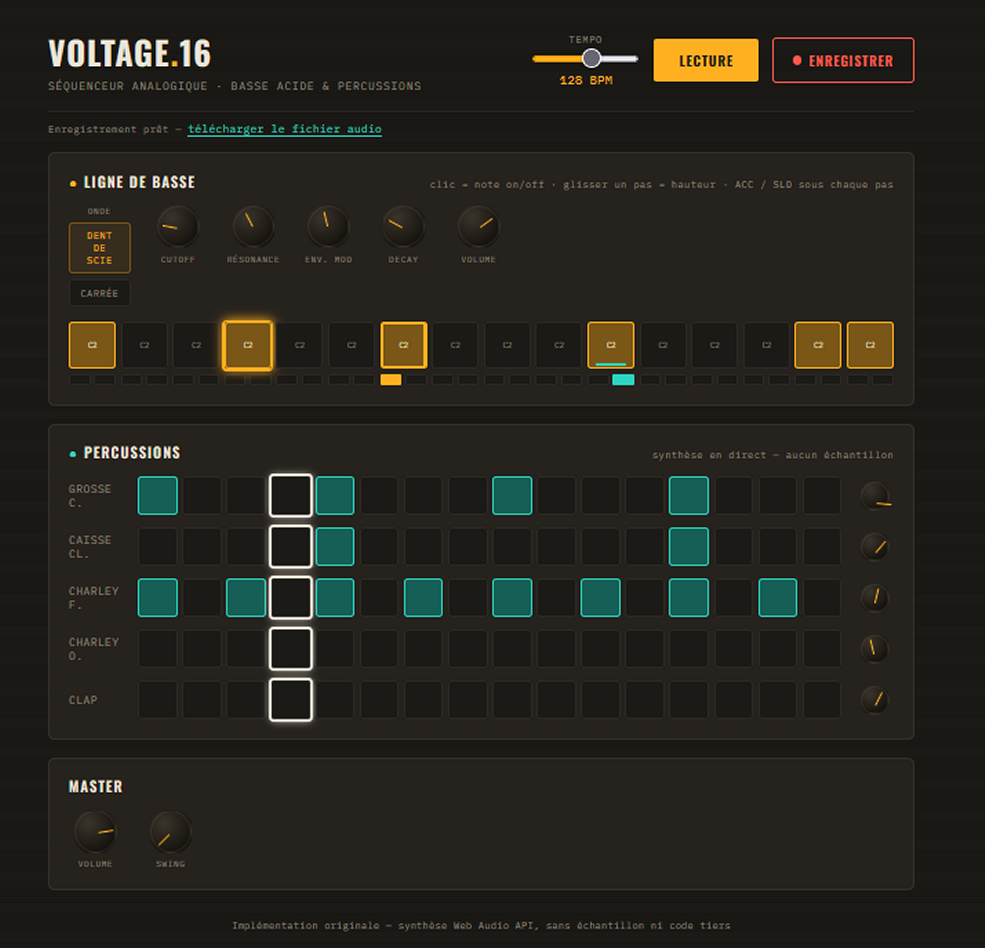

# 🎛️ VOLTAGE.16

Séquenceur pour navigateur web, combinant une ligne de basse de
type acid et cinq voix de percussion. L'ensemble du son est synthétisé
en temps réel via la Web Audio API — aucun échantillon audio, aucune
dépendance externe, aucun serveur requis.

Ce projet est une implémentation originale, pensée dans le même esprit
que les boîtes à rythmes/synthétiseurs analogiques classiques
(basse acide + séquenceur de percussions), mais entièrement réécrite
à partir de zéro : aucun code ni asset n'a été repris d'un logiciel
tiers.

---

## Fonctionnalités

- **Synthèse de basse** — oscillateur dent de scie ou carrée, filtre
  passe-bas avec enveloppe, accent et glissando (slide) par pas.
- **Cinq voix de percussion** — grosse caisse, caisse claire, charley
  fermé, charley ouvert, clap, toutes générées en direct (oscillateurs
  et bruit filtré).
- **Séquenceur 16 pas** avec swing réglable et tempo de 60 à 180 BPM.
- **Enregistrement intégré** — capture du signal audio joué et export
  en fichier téléchargeable, sans logiciel externe.
- **Contrôles façon matériel analogique** — boutons rotatifs
  actionnés par glissement vertical, pas de simples curseurs.
- Compatible tactile, focus clavier visible, respecte
  `prefers-reduced-motion`.

---

## Utilisation

Aucune installation n'est nécessaire.

1. Ouvrir `voltage16.html` directement dans le navigateur (double-clic).
2. Cliquer sur **Lecture** pour démarrer le motif par défaut.
3. Modifier le motif :
   - clic sur un pas : activer/désactiver la note ou le coup de
     percussion ;
   - glisser un pas de basse verticalement : changer la hauteur de la
     note ;
   - boutons **ACC** / **SLD** sous chaque pas de basse : accent et
     glissando ;
   - boutons rotatifs : cliquer-glisser verticalement pour régler la
     valeur.

Fonctionne hors ligne une fois la page chargée (les polices sont
chargées depuis Google Fonts au premier chargement, tout le reste est
local).

---

## 📸 Screenshot

---

## 🔴 Enregistrement audio

Le bouton **Enregistrer**, à côté de Lecture, capture directement le
signal envoyé aux haut-parleurs.

1. Cliquer sur **Enregistrer** — la lecture démarre automatiquement et l'enregistrement commence.
2. Cliquer à nouveau (**Arrêter l'enreg.**) pour terminer.
3. Un lien de téléchargement apparaît sous les boutons de transport,
   menant vers un fichier `.webm` prêt à être sauvegardé.

Implémentation : un second bus de sortie audio
(`MediaStreamAudioDestinationNode`), reçoit le même signal que la
sortie principale, encodé à la volée par `MediaRecorder`. Fonctionne
dans Chrome et Edge ; la prise en charge de `MediaRecorder` varie selon
les navigateurs (Firefox et Safari en particulier).

---

## Architecture technique

| Élément                 | Détail                                                                                            |
|-------------------------|---------------------------------------------------------------------------------------------------|
| 🐝 Basse                | Oscillateur → filtre passe-bas (cutoff, résonance, enveloppe) → gain                              |
| 🥁 Grosse caisse        | Oscillateur sinusoïdal, glissando de fréquence 150 Hz → 40 Hz                                     |
| 🎯 Caisse claire        | Bruit filtré (passe-bande) + tonalité courte                                                      |
| 🔨 Charleys             | Bruit filtré (passe-haut), durée d'extinction courte ou longue                                    |
| 👏 Clap                 | Trois impulsions de bruit filtré légèrement décalées                                              |
| 🔨 Cadencement          | Scheduler à anticipation (lookahead), synchronisé sur l'horloge audio, pas sur `setInterval` seul |
| 🔴  Enregistrement      | `MediaStreamAudioDestinationNode` + `MediaRecorder`                                               |

Fichier unique (`voltage16.html`), sans framework ni étape de build.

---

## Limitations connues

- Synthé de basse monophonique (une seule note à la fois, conforme au
  comportement d'une ligne de basse acide classique).
- Le démarrage audio nécessite une interaction utilisateur explicite
  (contrainte standard des navigateurs, pas un choix du projet).
- Le format d'enregistrement dépend du navigateur ; testé
  principalement sous Chrome/Edge.

---
## Licence
MIT – fais-en ce que tu veux. Transforme-le, réaménage-le, tout est permis.
🎉
